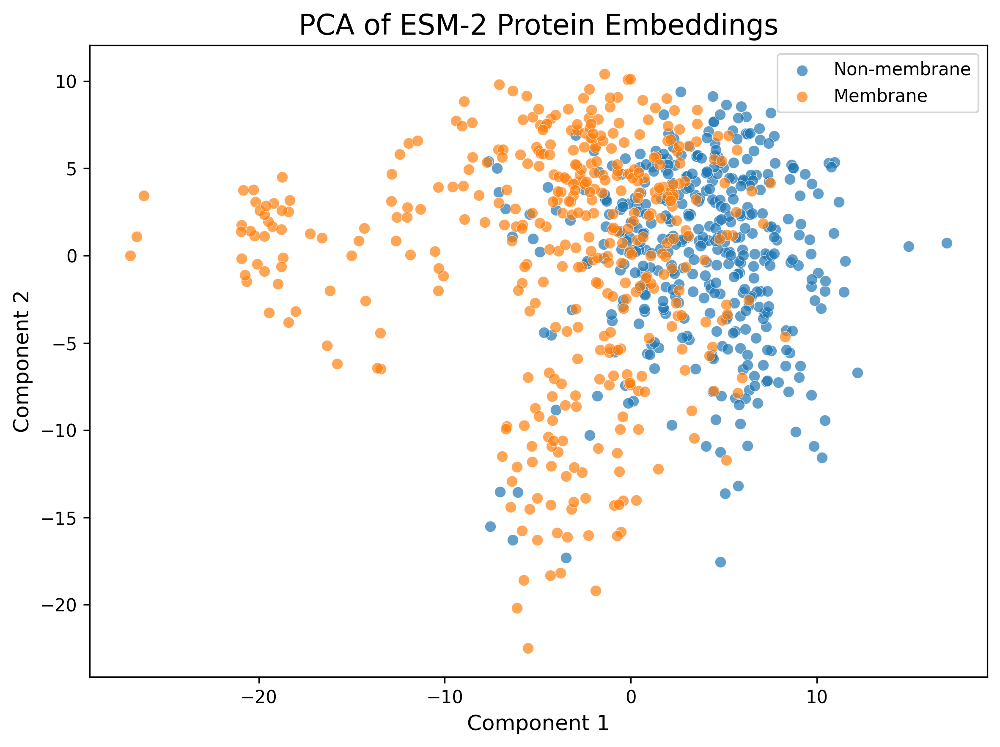
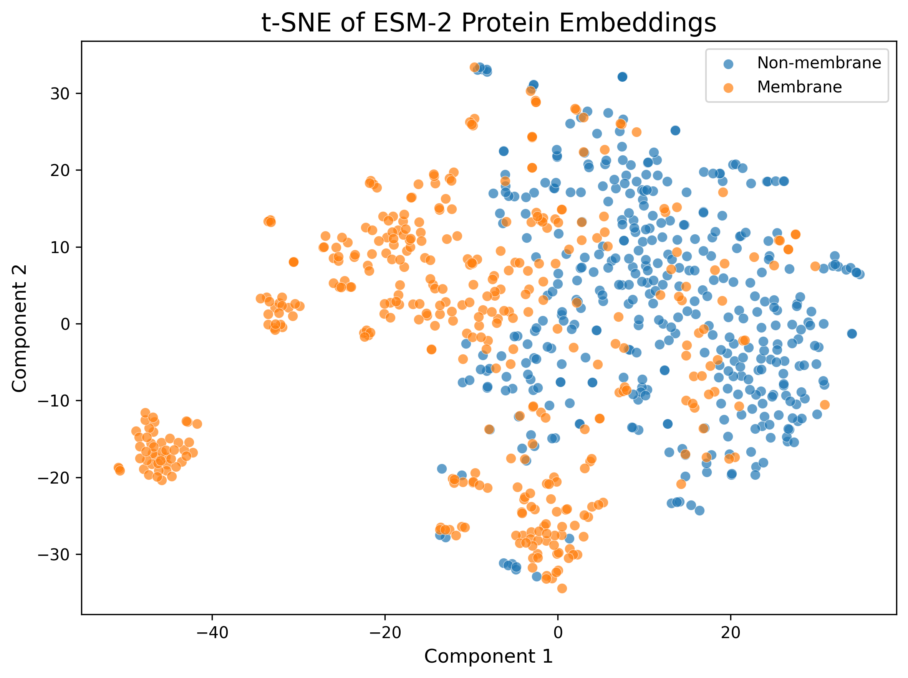
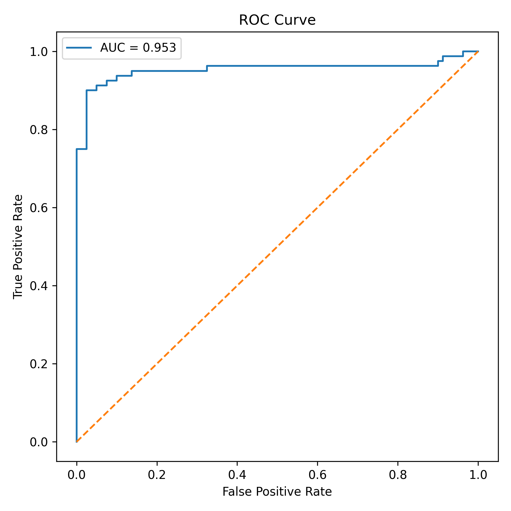

# ESM-2 Protein Embedding Classification

This project explores whether pretrained protein language model embeddings from ESM-2 can distinguish membrane from non-membrane proteins using only amino acid sequence information.

---

## Project Overview

Protein language models such as ESM-2 learn biologically meaningful representations from large-scale protein sequence data. These learned embeddings can support downstream computational biology tasks including protein function prediction, localization analysis, and structure-function studies.

In this project, I:

- Retrieved reviewed protein sequences from UniProt
- Generated protein embeddings using Meta AI's pretrained ESM-2 model
- Applied downstream machine learning classifiers
- Visualized embedding structure using PCA and t-SNE
- Evaluated classification performance for membrane protein prediction

---

## Biological Motivation

Membrane proteins contain characteristic hydrophobic transmembrane regions and structural motifs that are important for cellular signaling, transport, and drug targeting.

The goal of this project was to investigate whether these biological properties are encoded within pretrained protein language model representations without explicit feature engineering.

---

## Dataset

Protein sequences were retrieved from UniProt using reviewed entries:

- Class 1: membrane proteins
- Class 0: non-membrane proteins

Filtering criteria:
- Reviewed proteins only
- Sequence length between 50–800 amino acids

Final dataset:
- 800 protein sequences total
- Balanced class distribution

---

## Methods

### Embedding Generation

Protein embeddings were generated using:

- Model: `facebook/esm2_t6_8M_UR50D`
- Framework: Hugging Face Transformers + PyTorch

Residue-level embeddings were mean pooled into fixed-length protein representations.

### Downstream Classification

The following classifiers were evaluated:

- Logistic Regression
- Random Forest
- SVM (RBF Kernel)

### Dimensionality Reduction

Embedding space visualization:
- PCA
- t-SNE

---

## Results

| Model | Accuracy | F1 | Precision | Recall |
|---|---:|---:|---:|---:|
| Logistic Regression | 0.925 | 0.924 | 0.936 | 0.913 |
| Random Forest | 0.869 | 0.859 | 0.928 | 0.800 |
| SVM (RBF) | 0.913 | 0.908 | 0.958 | 0.863 |

The best-performing model was logistic regression, suggesting that ESM-2 embeddings already provide a representation space where membrane and non-membrane proteins are largely linearly separable.

The first two principal components explained approximately 24.7% of the variance in the embedding space.

---

## PCA Visualization



---

## t-SNE Visualization



---

## ROC Curve



---

## Biological Interpretation

The observed clustering patterns suggest that pretrained ESM-2 embeddings capture sequence-level properties associated with membrane localization.

The strong performance of simple downstream classifiers indicates that biologically relevant information is encoded in the learned embedding space without task-specific deep learning training.

The overlap between classes is expected, as protein localization and function are complex biological properties that cannot always be linearly separated.

---

## Repository Structure

```text
src/
├── 01_download_data.py
├── 02_embed_sequences.py
├── 03_train_classifier.py
└── 04_visualize.py

results/
├── metrics.csv
├── pca_embeddings.png
├── tsne_embeddings.png
└── roc_curve.png
├── metadata.csv
├── labels.npy
├── esm2_embeddings.npy

data/
└── protein_sequences.csv
```

---

## Technologies Used

- Python
- PyTorch
- Hugging Face Transformers
- scikit-learn
- pandas
- matplotlib
- NumPy

---

## Future Work

Potential extensions include:

- Evaluation of larger ESM-2 models
- Comparison with ProtBERT embeddings
- Incorporation of AlphaFold structural information
- Geometric deep learning approaches
- Multi-class protein function prediction
- Protein design applications

---

## References

- ESM-2: Evolutionary Scale Modeling of Protein Sequences
- UniProt Protein Database
- Hugging Face Transformers
